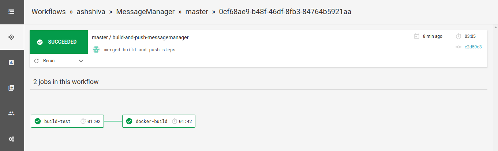

# MessageManager

## About this project
MessageManager is an application that manages messages and provides details about them. More specifically it tells you if a message is a palindrome or not, in addition to when the message was created and/or updated. The application provides REST API endpoints to create, update, retrieve, delete a message and list all available messages. The messages have to be unique, which is checked before saving or updating them. 

This application is implemented in Java as a Spring Boot application.

## Architecture
I make use of the MVC model to build the MessageManager Service. Message makes up the model along with the service layer and repository integration. CLI terminal interface makes for our View. Controller and action methods accept incoming requests, route it to the appropriate service layer which in turn, access the Repository/Entity objects and thus interacts with the database. 

The planned deployment architecture is depicted below:


## Supported Databases
Currently the MessageManager application only supports H2, the embedded database that comes along with spring boot. I can plan to support other RDBMS like MySQL/PostgreSQL in future. Also, I can come up with a strategy to support migrations (using flyway or liquibase) when I get there. 

## How to build and run the application
A makefile is included to help build and run the application with ease.

*Disclaimer: In its current state, the project and the provided Makefile have been tested on Linux and Mac and not on Windows, including Windows Subsystem for Linux (WSL).*

Here are a list of commands that can be used:

*Please note:* Before using the commands below to clean, build or run the project, please set `GRADLE_HOME` environment variable either globally in your system or in your shell.
```sh
export GRADLE_HOME=<GRADLE HOME DIRECTORY>
```

*PLEASE NOTE: All 'make' commands are to be run from within the MessageManager directory.* 
- To clean the previous builds
```sh
make clean
```

- To clean and build the project with a specific `version`
```sh
make build version=1.0.0
```
If you just want to use the default `version`, you can skip the `version` argument
```sh
make build
```

- To clean, build and run the project with a specific `version`
```sh
make run version=1.0.0
```
(OR) to just run with a default `version`
```sh
make run
```
Now that the application is running, you can access it in the browser at: http://localhost:8080/swagger-ui.html
If you have overridden the default port, please update the port number accordingly.

- To build the MessageManager application in to a Docker container image with a specific `version` using Docker buildkit (this is a multi-stage Docker build where the first stage builds the jar and second stage just runs the jar in a alpine jre base image to reduce the attack surface)
```sh
make docker version=1.0.0 
```
(OR) to use the default `version`
```sh
make docker
```

- To run the MessageManager application using Docker with the built image
```sh
make docker-run version=1.0.0
```
(OR) to use the default `version`
```sh
make docker-run
```
If you want to override the default port `8080`, you can also pass that as an argument to the `make docker-run` command
```sh
make docker run version=1.0.0 port=9090
```

- In order to run the tests, please run the following command in a terminal:
```sh
make test
```
You can observe the results generated as XML here:
`build/test-results/test/` 

To view the html test results, open the `index.html` file located at: `build/reports/tests/test/`

- To run code coverage along with tests, run the following command in a terminal:
```sh
make jacoco
```
The code coverage report can be viewed at this location: `build/reports/jacoco/test/html/index.html`

XML report can be viewed here: `build/reports/jacoco/test/jacocoTestReport.xml`


## How to access the application
There are 2 ways to run the application:

- Since source code is included, you can just run the MessageManager application as a SpringBoot application directly or by using the provided `Makefile` and access the REST APIs.
*Please note: You will need to have Java and gradle installed and their paths appropriately set in order to be able to go the above route.*

- docker - run the application in a docker container, which would have mapped the host port to the container port.

And 2 ways to access the running application:

- To make it easier I have included Swagger UI which loads the swagger specification and provides a good UI which can be accessed here: http://localhost:8080/swagger-ui.html in order to test it. <br />
*Please note: The included swagger UI will only work on `localhost`.*

- CLI - use the CLI I have created as a bash shell script to test the MessageManager applciation. There is help available as part of the CLI to test the REST APIs supported by MessageManager application.<br />
To access help and get started, run the following commands from the terminal from within the same cloned MessageManager directory:
  ```sh
  chmod +x mmcli.h
  ```
  ```sh
  ./mmcli -h
  ```


## Documentation
**REST API docs** - REST API documentation is provided through swagger. Included Swagger UI also serves as a documentation. Also, the code has inline comments to increase readability and understanding of the code.

The swagger json spec can be accessed at `http://localhost:8080/v2/api-docs` and the swagger UI itself can be accessed at `http://localhost:8080/swagger-ui.html`

If you have overriden the default port, please update the URL accordingly.

**Javadocs** - Javadocs can be generated using the command:
```sh
make javadoc
```
The generated javadocs can be found in this location:
`build/docs/javadoc/index.html`

## Continuous Integration
Github Repository is integrated with CircleCI to run tests, build Docker container image and push to Dockerhub on the master branch. The CircleCI configuration describing the CI workflow can be found at `.circleci/config.yml` .

Here is a recent snapshot of the CircleCI page, with the workflow described above.


The built images are pushed to Dockerhub, and are made available here:
`https://hub.docker.com/r/ashwathisshiva/messagemanager`

If you want to give it a try, you can do so by running:
```sh
docker pull ashwathisshiva/messagemanager
```

## Custom Exceptions

- DuplicateMessageException - thrown when a duplicate mesaage is supplied during create and update operations.
- MessageNotFoundException - thrown when a message is not found in the database in the get specific message and delete operations.
- InvalidIdException - thrown when the id specified is null or negative get specific message and delete operations.
- EmptyMessageException - thrown when a supplied message is null or empty during create and update operations.
- UnknownException - Any other exceptions that might arise during runtime.

## Future Action items
- Support MySQL / PostgreSQL for long-term storage
- bring in migration strategies to manage schema changes using a system like liquibase
- Confirm that the included commands in the `Makefile` and `mmcli` above will work on Windows (with/without WSL).
- Incorporate soft-delete
- Deploy to AWS by following the architecture depicted above.


